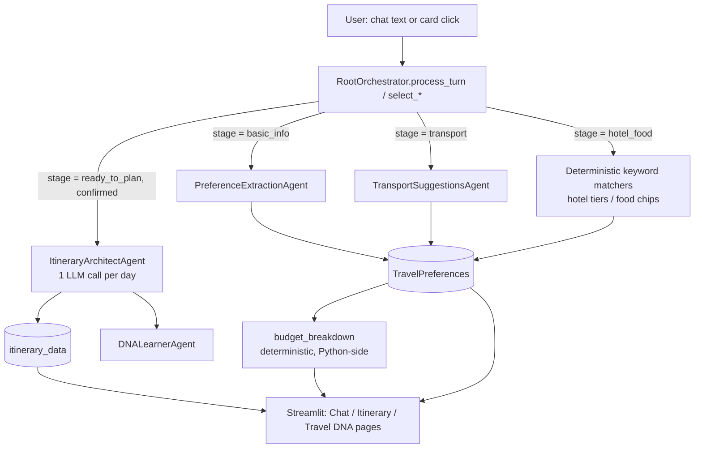

# Horizon Travel AI — Project Documentation

This document is the project's working record: what problem it solves, how it was
designed, and — in the **Phase 1** section — a step-by-step account of the actual
build-and-debug journey so far, written for a project validator/reviewer to follow
the reasoning behind every decision, not just the final code.

---

## Checkpoint 1 — Problem Definition

### Project Title
**Horizon** — an autonomous, multi-agent conversational travel planning assistant.

### Project Description
Horizon is a chat-first travel planning application. A user describes a trip in
plain language (or picks from interactive option cards), and a coordinated set of
specialist AI agents — a preference extractor, a conversational concierge, a
transport-search agent, and an itinerary architect — progressively gathers the
trip's requirements (destination, budget, dates, source, arrival timing, transport
choice, hotel tier, food preference) and produces a day-by-day, activity-level
itinerary with cost, confidence, and evidence for every recommendation.

### Project Problem Statement
Planning a trip today means juggling several disconnected tools: a flight search
site, a hotel comparison site, a handful of "best things to do in X" blog posts,
and a spreadsheet to track whether all of that fits the budget. None of these
tools talk to each other, none of them know the traveler's actual constraints
(a chosen hotel tier, a chosen flight, a stated food preference) at the point
they generate recommendations, and none of them explain *why* a suggestion is
being made or *how confident* it is. The result is a slow, manual, error-prone
planning process, and a real risk of the final plan silently exceeding budget
because nothing forces the flight + hotel + activities numbers to be added up
together in one place.

**The specific problem Horizon solves:** provide a single conversational
interface that (a) collects trip constraints with minimal friction, (b) uses
generative AI to research and propose transport, lodging, and activities
consistent with those constraints, and (c) keeps an accurate, always-visible
running budget total built from the traveler's *actual* choices — not a vague
estimate — so budget mismatches surface immediately instead of at checkout.

### Research: Existing Solutions and Their Limitations
| Existing solution | What it does well | Limitation Horizon addresses |
|---|---|---|
| Booking sites (MakeMyTrip, Skyscanner, Booking.com) | Real inventory, real prices, mature search/filter UI | Siloed per category (flights *or* hotels *or* activities) — nothing unifies them into one budget-aware plan, and there's no conversational, preference-driven guidance |
| Generic LLM chatbots (ChatGPT, etc.) asked to "plan my trip" | Fast, flexible, good at prose itineraries | No persistent structured state — every message re-explains constraints; no UI for quick choices; no live cost tracking; itinerary content can be inconsistent turn to turn |
| Static "Top 10 things to do in X" travel blogs/guides | High-quality curated content | Not personalized to budget, dates, hotel location, or food preference; no interactivity |
| Travel agents (human) | Deep expertise, accountability | Slow, expensive, doesn't scale, business hours only |

### Proposed Solution
A multi-agent, stage-driven chat application (Streamlit + LangChain + an
OpenAI-compatible LLM via OpenRouter) that:
1. Extracts structured trip preferences from free-form chat text.
2. Walks the user through arrival time → transport → hotel tier → food
   preference, offering both typed answers and clickable option cards.
3. Computes a running, accurate budget estimate from the user's actual
   selections (not a flat guess) at every step, with a clear over-budget warning.
4. Hands off a fully-specified preference set to an "Architect" agent that
   generates a day-by-day itinerary with per-activity cost, walking distance,
   crowd level, and a confidence score with supporting evidence.
5. Lets the user replan from scratch at any point.

### Success Criteria (measurable)
- A user can go from "I want to plan a trip" to a complete, itemized itinerary
  in a single chat session with **no more than 6-8 user turns**.
- The chat **never crashes** on a missing/failed LLM call — every agent call has
  a deterministic fallback path (verified by automated "total LLM outage" tests).
- The displayed budget total is accurate to the traveler's **actual selected**
  transport price and hotel tier, not a generic placeholder (verified by
  `budget_breakdown()` unit tests).
- The generated itinerary always contains **exactly the number of days requested**
  (verified by a regression test after this was found to silently fail).
- **Zero blank cost/crowd/transport fields** in the rendered itinerary (backfill
  guarantee, verified by unit test).
- Core conversational logic (stage transitions, keyword parsing, replan,
  fallbacks) is covered by an automated test suite runnable without a live LLM
  connection.

### Feature Prioritization
| Must-have (v1) | Nice-to-have (later) |
|---|---|
| Conversational slot-filling for destination/budget/days/origin | Real-time flight/hotel price APIs (currently LLM-estimated) |
| Deterministic stage machine with graceful LLM-failure fallbacks | Multi-city / multi-leg trips |
| Structured (schema-enforced) itinerary generation | User accounts / saved trip history |
| Accurate running budget total from real selections | Collaborative/shared trip planning |
| Interactive transport/hotel/food option cards | Voice input |
| Replan / start-over | PDF export polish, calendar export |
| Automated test coverage (unit + scenario + live UI smoke test) | A/B testing of prompt variants |

### Draft Timeline (2 weeks)
| Days | Milestone |
|---|---|
| 1-2 | Scaffold agents (Concierge, Extractor, Architect, DNA Learner), basic Streamlit shell, first "Hello World" LLM round trip |
| 3-4 | Wire `RootOrchestrator`, define `TravelState`/`TravelPreferences`, get one full happy-path conversation working end to end |
| 5-6 | Add Transport Suggestions agent, hotel/food preference stages, budget-alert logic |
| 7-8 | **Phase 1 hardening** (this document's focus): fix crashes, schema mismatches, infinite loops, and reliability bugs found via real usage |
| 9-10 | Add interactive option cards (transport/hotel/food) and live budget tracking |
| 11-12 | Automated test suite: unit tests, end-to-end scenario tests, live browser verification |
| 13-14 | Documentation, polish, deployment verification on Streamlit Cloud |

---

## Checkpoint 2 — Implementation Plan

### Technical Approach
Horizon is built as a **single Streamlit application** (`app.py`) backed by a
**multi-agent orchestration layer** (`src/orchestrator.py`) that owns a small
set of specialist agents, each a thin wrapper around a single LLM responsibility:

- **`PreferenceExtractionAgent`** — free-text → structured `TravelPreferences`
  (via schema-constrained structured output).
- **`ConciergeAgent`** — natural-language prompting for whatever basic fields
  are still missing.
- **`TransportSuggestionsAgent`** — generates 3-4 structured transport options
  (mode/price/duration/times/rationale).
- **`ItineraryArchitectAgent`** — generates the day-by-day itinerary, **one day
  per LLM call** (see Phase 1, this was a deliberate fix, not the original design).
- **`DNALearnerAgent`** — extracts longer-term "Travel DNA" preference insights
  after a plan is built.

A single `RootOrchestrator.process_turn()` call is the **only** entry point the
UI uses for free-text input; a small set of `select_*` methods
(`select_transport_option`, `select_hotel_tier`, `select_food_preferences`) are
the entry points for the UI's clickable cards. Both paths converge on the same
`TravelState`/`TravelPreferences` models, so typing and clicking are fully
interchangeable at every stage.

Conversation progress is modeled as an explicit **finite state machine**
(`_current_stage()`): `basic_info → transport → hotel_food → ready_to_plan →
complete`. The stage is *recomputed from the actual preference data* on every
turn rather than trusted from a stored flag — this was itself the fix for a
real staleness bug (see Phase 1).

### Technology Stack

| Layer | Choice | Why |
|---|---|---|
| **AI Model(s)** | `openai/gpt-4o-mini` via **OpenRouter** (OpenAI-compatible endpoint) | Cost-effective, fast, supports function-calling structured output; OpenRouter allows swapping the underlying model without code changes |
| **Frameworks & Tools** | `langchain-openai` (`ChatOpenAI` + `with_structured_output`), `pydantic` v2 (schema definitions), `Streamlit` (UI) | LangChain gives a uniform structured-output interface across models; Pydantic enforces the exact JSON shape the UI expects; Streamlit enables a fast, reactive Python-only UI with no separate frontend build |
| **Database** | None — in-memory `st.session_state` (per-browser-session `TravelState`) | No persistence requirement yet (single-session planning tool); flagged as a limitation for multi-session/user history |
| **Infrastructure / Other** | Streamlit Community Cloud (deployment), GitHub (source control + PR-based workflow), `pytest` (test runner), Playwright + headless Chromium (live UI verification) | Zero-ops deployment target; PR-per-fix workflow keeps `main` deployable at all times |

### Architecture — Data Flow



Every LLM-touching step (`_extract_preferences`, transport search, itinerary
build) is wrapped in a `try/except` that falls back to a deterministic default —
this is the backbone of Horizon's reliability guarantee: **the UI never crashes
from an LLM failure**, it degrades to a simpler but still-functional response.

### Setup, API Connection, and "Hello World" Verification
1. `pip install -r requirements.txt`
2. `cp .env.example .env` and set `OPENROUTER_API_KEY`
3. `streamlit run app.py`
4. First round-trip check: send any message in the Chat tab — a successful
   reply (even a simple "could you tell me your destination?") confirms the
   `ChatOpenAI` client is correctly authenticating against OpenRouter.
5. `python3 -m pytest tests/` — runs the full suite (30 tests as of Phase 1)
   without requiring a live API key, since every LLM boundary is mockable.

---

## Phase 1 — Build & Debug Journal (Learning Curve)

This section documents **what was actually built and fixed**, in the order it
happened, as a learning record. The project did not arrive at its current state
in one pass — it went through repeated cycles of *ship → observe real behavior →
diagnose → fix → test → verify live*. That cycle, not any single commit, is the
core engineering lesson of Phase 1.

### 1.1 — Starting point: a broken baseline
The initial scaffold (`RootOrchestrator`, the four core agents, a Streamlit
shell) was in place but non-functional for real conversations:
- `process_turn()` called `self.estimate_trip_cost(...)`, a method that did not
  exist — every turn that reached the "ready" branch crashed.
- The preference-extractor's result was merged incorrectly (`{"updated_preferences": ...}`
  was folded into the preferences dict as a literal key instead of being
  unwrapped), silently corrupting state on every turn.
- `DNALearnerAgent` was truncated mid-file and referenced a `_parse_insights`
  method and a `state.dna_insights` field that didn't exist.
- There was no staged flow at all — the concierge just kept asking for
  whatever was missing, with no transport/hotel/food/confirmation steps.

**Lesson:** reproduce the crash first (`git log`, reading the actual code path
that fails), then fix the specific defect — don't rewrite around a symptom.

### 1.2 — Designing the staged conversation
Introduced the explicit stage machine (`basic_info → transport → hotel_food →
ready_to_plan → complete`) with deterministic keyword matchers for arrival
time, hotel tier, and food preference, so the LLM is only invoked where genuine
free-text understanding is required. Added `TransportSuggestionsAgent` wiring,
a budget-alert check, and a **Replan** command (chat keyword + a dedicated UI
button) that fully resets `TravelState`.

### 1.3 — Fixing the OpenAI strict-schema rejection
`transport_suggestions` was typed as a bare Python `dict`. OpenAI's structured
"strict" mode rejects arbitrary-key objects (`additionalProperties` must be
`false`, which is impossible for a free-form dict) — this made the preference
extractor fail **on every single turn**. Fixed by storing plain text instead,
and switched `with_structured_output` to `method="function_calling"` (a mode
that doesn't require strict-schema compliance) as a general safeguard.

### 1.4 — Fixing a hang right after answering arrival time
The arrival-time turn made **two sequential LLM calls** back-to-back (an
unconditional preference re-extraction, then the transport search), with no
client-side timeout — a slow API response could hang long enough to look like
the chat had crashed. Fixed by (a) adding `timeout=20s` / `max_retries=1` to the
shared LLM client, and (b) restructuring the orchestrator so the extractor only
runs where a deterministic keyword match actually misses, capping the common
path to one LLM call per turn.

### 1.5 — Fixing a stage-chip staleness bug
`process_turn()` captured `state.preferences` into a local variable *before*
dispatch, then a branch further down replaced `state.preferences` with a new
object (extraction doesn't mutate in place) — the final `planning_stage` write
landed on the old, now-detached object. The conversation still worked correctly
turn to turn (stage is recomputed fresh at the top of every call), but the
*displayed* stage indicator stayed stuck on "basic_info" even after all fields
were filled in. Fixed by always reading `state.preferences` fresh at the point
of the final write. Caught with a regression test that was verified to fail
without the fix and pass with it — not just "trust the fix," prove the test bites.

### 1.6 — Fixing the Itinerary tab's schema mismatch
The Itinerary page's rendering code and the Architect agent's actual JSON
output had **never used matching field names** — the renderer expected
`day['day']` / `day['activities']` / `act['activity']`; the Architect actually
produced `day['n']` / `day['segments']` / `segment['title']`. Any real,
chat-generated itinerary crashed the Itinerary tab with `KeyError: 'day'`;
only the hardcoded demo itineraries had ever rendered. Fixed by rewriting the
render loop to consume the Architect's real schema.

### 1.7 — Fixing an infinite loop
`ConciergeAgent` had a "pick a budget experience tier" menu that fired whenever
budget was known but destination wasn't — but **nothing anywhere processed the
user's reply** to that menu. If the extractor ever missed a destination in the
same message as a budget figure, every subsequent turn re-showed the identical
dead-end menu forever, regardless of what the user typed. Removed the dead-end
branch; the existing "ask for whatever's missing" fallback covers the case
correctly and lets the conversation self-correct.

### 1.8 — Fixing itinerary content quality
Live testing surfaced two more issues:
- **Blank per-activity fields.** The Architect's freeform JSON output had no
  structural guarantee — segments would render with placeholder defaults
  ("Activity", 60 min, 80% confidence) because the model's output simply
  didn't match the expected field names, despite the prompt asking for them.
  Fixed by switching the Architect to `with_structured_output` against a
  proper Pydantic schema (`ItineraryPlan`/`ItineraryDay`/`ItinerarySegment`),
  and adding a deterministic backfill for any field the model still omits
  (cost → 0, crowd → "moderate", transport → "Walk"/"Return to hotel").
- **Itinerary ignored the traveler's actual hotel/transport choice.** "Total
  Estimated Spend" only summed the LLM's day-by-day activity costs — hotel and
  transport, the two largest trip costs, were silently excluded. Fixed by
  computing those deterministically in Python and showing an honest grand
  total with an explicit over-budget warning.

### 1.9 — Building a real test suite and proving it with live verification
Added three layers of testing:
1. **Unit tests** (`test_orchestrator.py`) for individual stage transitions and bug fixes.
2. **End-to-end scenario tests** (`test_chat_scenarios.py`) simulating realistic
   multi-turn conversations — piecemeal vs. all-at-once info, phrasing variety,
   a full LLM outage degrading gracefully, itinerary build failure + retry,
   replan from every stage — with only the LLM network boundary mocked.
3. **Live browser verification** — launched the actual Streamlit app with
   Playwright and clicked through every page, confirming zero Python
   tracebacks, since automated tests alone can't catch UI wiring mistakes.

### 1.10 — Interactive option cards and live budget tracking
Replaced pure free-text answers for transport/hotel/food with clickable,
booking-site-style option cards, while keeping typed answers fully functional
(additive, not a replacement). Selections feed real numbers into a new
`budget_breakdown()` helper, so the running budget total shown in chat and on
the Itinerary tab is now built from the traveler's actual choices instead of a
flat per-day guess.

### 1.11 — Fixing itinerary days silently going missing
Real-world testing (a 3-day trip request) showed the itinerary contained only
Day 1 — very detailed, 8 activity segments — with Days 2 and 3 entirely absent.
Root cause: the Architect asked for **all N days in a single structured-output
call**; the model would sometimes produce one richly detailed day and stop,
ignoring "produce exactly N days" — an array-length constraint the schema
itself cannot enforce, so the call "succeeded" with valid but incomplete JSON.
Fixed by generating **one day per LLM call** in a Python loop — the day count
is now a fact guaranteed by `range(1, days+1)`, not something the model can
shorten. While investigating, found the same root cause behind several earlier
quality issues: all three structured-output agents were passing a bare string
to `.invoke()`, which LangChain sends as a single human message — **the
carefully written system prompts were never actually reaching the model.**
Fixed all three to pass an explicit system message.

**Recurring lesson across 1.3–1.11:** almost every reliability bug in this
project came from the same root cause — *treating an LLM's output as if it had
a structural guarantee it didn't actually have*. The fix pattern was
consistently: (a) constrain the output with a real schema wherever possible,
(b) add a deterministic backfill/fallback for what a schema can't force, and
(c) prove the fix with a test that fails without it.

---

## GenAI Concepts — Coverage Snapshot

| Concept | How it's covered in this project |
|---|---|
| **Prompt engineering** | Distinct system prompts per agent (Concierge, Extractor, Transport, Architect), each scoped to one responsibility; discovered and fixed a bug where three agents' system prompts were never actually being sent (see 1.11) |
| **Structured output / function calling** | `TravelPreferences`, `TransportOptionsList`, and `ItineraryDay` are all enforced via `with_structured_output(..., method="function_calling")` rather than parsing free text |
| **Multi-agent orchestration** | `RootOrchestrator` coordinates 5 specialist agents (Concierge, Extractor, Transport, Architect, DNA Learner), each single-purpose, composed via a shared state object |
| **Agentic / stage-based workflow** | Conversation modeled as an explicit finite state machine (`_current_stage()`), recomputed from live data every turn rather than trusted from a cached flag |
| **Conversational memory / state management** | `TravelState`/`TravelPreferences` (Pydantic models) persist across turns in `st.session_state`, fed back into every subsequent prompt |
| **Prompt chaining** | A single user turn can chain through extraction → stage dispatch → transport search → next question, all within one `process_turn()` call |
| **Grounding & deterministic guardrails** | Keyword matchers for arrival time/hotel/food act as a reliable layer beneath the LLM, so free-form understanding failures don't break the conversation |
| **Hallucination / reliability mitigation** | Deterministic backfill for missing itinerary fields; budget totals computed in Python, never trusted to the LLM's arithmetic; per-day generation loop to guarantee day count |
| **Confidence scoring & explainability** | Every itinerary segment carries a 0-100 confidence score and categorized evidence (`dna`/`live`/`local`/`web`/`comm`/`pref`) shown in the UI |
| **Human-in-the-loop / hybrid UI** | Interactive option cards for transport/hotel/food sit alongside free-text chat — either input path updates the same underlying state |
| **Cost & latency optimization** | Extractor calls are skipped when a deterministic match already succeeds; LLM client has an explicit timeout/retry cap to avoid hangs |
| **LLM evaluation & testing** | Three-layer test strategy — unit tests, mocked end-to-end conversation scenarios, and live-browser Playwright verification — since LLM output can't be asserted on directly, but the surrounding system's behavior can |
| **Model/provider abstraction** | OpenRouter used as an OpenAI-compatible gateway, so the underlying model (`gpt-4o-mini`) can be swapped without touching agent code |

---

## Limitations

- **No real-time data.** Transport prices, durations, and itinerary content are
  LLM-estimated, not sourced from a live flights/hotels/activities API. Prices
  shown are realistic approximations, not bookable quotes.
- **LLM instruction-following is not 100% reliable.** Even with schema
  enforcement, the model can produce lower-quality content (generic
  descriptions, occasional field omissions) that the deterministic backfill
  can mask structurally but not fully improve qualitatively.
- **No persistence layer.** Trip state lives only in the browser's Streamlit
  session; closing the tab or the server restarting loses the conversation.
  There is no user account system, login, or saved-trip history.
- **Single-session, single-user.** No support for collaborative planning,
  multiple simultaneous trips per user, or multi-device continuity.
- **No booking/payment integration.** Horizon plans a trip; it does not
  purchase tickets, reserve hotel rooms, or handle any real transaction.
- **Testing cannot validate live LLM output quality end-to-end.** Automated
  tests mock the LLM boundary (necessary for speed, determinism, and to run
  without network access); real content quality was validated by manual live
  testing against the deployed app, not by the automated suite.
- **India/INR-centric prompting.** Transport and cost prompts are tuned for
  Indian pricing conventions; using the app for other regions would need
  prompt adjustments.
- **No CI/CD pipeline yet.** Tests are run manually before each PR merge;
  there's no automated gate blocking a broken merge to `main`.
- **Single LLM provider path.** Only `openai/gpt-4o-mini` via OpenRouter has
  been exercised; behavior with other models is unverified.

---

## Appendix — Running the Project

```bash
pip install -r requirements.txt
cp .env.example .env        # add your OPENROUTER_API_KEY
streamlit run app.py

# Run the automated test suite (no live API key required):
python3 -m pytest tests/ -v
```
